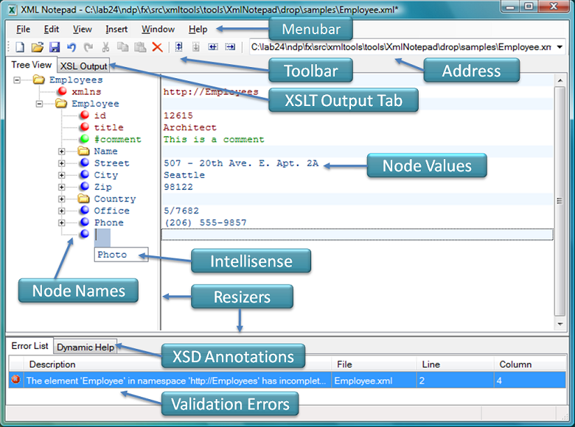

# XML Notepad Design

[Chris Lovett](http://lovettsoftware.com/), Microsoft

I finally got around to fulfilling a promise I made to a friend at MSDN. Back in 1998, we shipped the first XML Notepad,
written by Murray Low in C++. Later on it fell behind in support for XML standards and, because we didn't have time
to fix it, we pulled it off MSDN. But Murray apparently did such a nice job that MSDN was inundated with requests to
put the notepad back up, so MSDN asked me for a replacement.

I was working on System.Xml in C# in 1999, so I figured I could crank out a replacement using the .NET
Framework pretty quickly. Well, the problem was it was one of those side projects on my "one-day" list — you know
how that goes! Fortunately, a good friend of mine, Michael Corning, took interest in it, helped hold my feet to the
fire, and also added some cool features himself. Dan Doris also took pity on me and helped identify some great bugs.
So here we are, finally, with something that should be useful to those who want a quick way to view and edit XML
documents.

We've had over 3 million downloads since then so I'm happy I made the effort.
Thanks to everyone who tried it out.

For those who know the original version, the interface should look familiar: a tree view on the left synchronized with
a node text view on the right and handy nudge toolbar buttons for quick movement of nodes up and down the tree:

Because it's been so long since the first version, I couldn't resist leveraging the cool stuff in System.Xml and so I added
some bells and whistles that the original version didn't have, including:

- Incremental search (CTRL+I) in both tree and text views, so that as you type it navigates to the most matched
node.
- Cut/copy/paste with full namespace support in a simple interoperable XML format.
- Drag/drop support for easy manipulation of the tree, even across different instances of XML Notepad and
from the file system.
- Infinite undo/redo for all edit operations.
- In-place, pop-up, multi-line editing of large text node values and IntelliSense based on expected elements
and attributes.
- Configurable fonts and colors via the options dialog.
- Full find/replace dialog with support for regex and XPath expressions.
- Good performance on large XML documents (loading a 3 MB document in about one second).
- Instant XML schema validation while you edit with errors and warnings shown in the task list window.
- Support for custom editors for date, dateTime, time, and color datatypes.
- HTML viewer for displaying XSLT transformation results.
- Built-in XML Diff tool.

## Design and Implementation

In the github repo you'll find the core `XmlNotepad` dll project, an `Application` project that builds
XmlNotepad.exe, the `XmlDiff` library projects used in the XML diff feature, a `XmlNotepadSetup` project for building the .msi
installer, and the `UnitTests` project for testing XML Notepad.

The following DGML diagram shows the relationships between the main UI classes. The main form contains all the UI
elements from the TaskList to the main XmlTreeView with Resizers in between; it's the launching point for the dialogs
such as FormSearch, FormSchemas, FormOption, and FormAbout.

The main tab control contains the XmlTreeView and the XsltViewer for showing XSL output. The XmlTreeView
contains a TreeView on the left and a NodeTextView on the right and coordinates scrolling between these two views.
Both the TreeView and NodeTextView provide the same IntelliSense editing functionality using a TextEditorOverlay
component. The XmlTreeView implements IFindTarget, which is used by the Find dialog (FormSearch) to implement
find/replace functionality.

The Find dialog supports full text, regex, or XPath expressions and can filter by names or values. Here you see the
XPath search, which also provides a table for entering namespace prefix mappings used in the query.

## Validation, IntelliSense, and Custom Editors

The biggest new feature is IntelliSense, which is driven by XML Schema information provided via the SchemaCache.
For example, if your element or attribute is defined by an XSD simpleType and this simpleType contains a list of
enumeration facets, then you will get a drop-down like this:

The way this works is that the Checker runs after each edit operation to validate the document and report errors in
the TaskList. This process also puts System.Xml.Schema.XmlSchemaType information on each element and attribute
in the XmlDocument; then, when editing the value of that node, the TextEditorOverlay uses the
XmlIntelliSenseProvider to get back a list of possible values. In the above example it returns the values from the
simpleType enumeration facets. For element name IntelliSense in the tree view, the XmlIntelliSenseProvider invokes
the Checker again, captures GetExpectedParticles and GetExpectedAttributes on the
System.Xml.Schema.XmlSchemaValidator, and uses that to provide IntelliSense.

The TextEditorOverlay also supports custom editors like the DateTimeEditor or the UriBuilder or ColorBuilder. There
are two types of custom editors: IXmlEditors, which are inline editors that replace the default TextBox, and
IXmlBuilders, which are popup dialogs like the OpenFileDialog or ColorDialog. The type of editor is derived from the
schema type information — "xs:date", "xs:time", "xs:datetime" results in the DateTimeEditor, and "xs:anyURI" results
in the UriBuilder. You can also annotate the schema with a custom "vs:builder" attribute in the
"http://schemas.microsoft.com/Visual-Studio-IntelliSense" namespace. See the Help content for more information.

## Infinite Undo/Redo

To implement undo/redo I followed a common design pattern of Command objects with Undo and Redo methods.
The UndoManager collects these in a list. Then the state of the UndoManager controls the enabled/disabled state of
the Undo/Redo MenuItems. When the user selects the Undo menu item, the Undo method is called on the active
command, and that command is pushed onto the Redo stack.

Some operations in the editor cause many edits in the tree including the replace-all operation and editing the value
of a namespace attribute. (When you change the value of a namespace attribute. every XmlNode bound to that
namespace needs to be reconstructed with a new namespace URI, which can obviously affect a lot of nodes in the
tree!) So, to make these operations one atomic undo operation, there is a CompoundCommand object that contains
a list of smaller edit commands, and this CompoundCommand is put into the UndoManager.

Other simpler command objects include the following, which all operate on XmlTreeNode and XmlNode objects:

The PasteCommand is special because it takes random XML text off the clipboard and parses it in context of the
currently selected element in the tree, inheriting the namespaces in scope. The helper class TreeData uses the special
XmlTextReader constructor that takes an XmlParserContext as input.

## Unit Testing

I had to do a good job of testing the new XML Notepad, and I was looking for an excuse to use the new Visual Studio
 UnitTest projects. The UnitTest runs from the Test Explorer under the Test menu from within Visual Studio,
launching XML Notepad and executing all the test methods I've written.

When the test completes, you can then right-click on the Test Results window and select "Code Coverage Results".
This brings up a summary of how many blocks were covered in each function. You can double-click the row in the list
to bring up a color-coded source code view showing exactly which code has been covered. This made it really easy
for me to get the code coverage up to about 85 percent.
The only trick is that you don't get code coverage when you run the tests under the debugger, and the UnitTest
project creates a file next to your solution called "localtestrun.testrunconfig" and "XmlNotepad.vsmdi," which you
should not lose. If you do, then code coverage also will not work.

## Conclusion

I hope you enjoy the all new XML Notepad. Feedback and suggestions are welcome,
just use the github issues list.  Pull requests are also welcome, in fact,
a number of good pull requests have already been merged.  Thanks to
all who are helping to make XML notepad a great tool!
