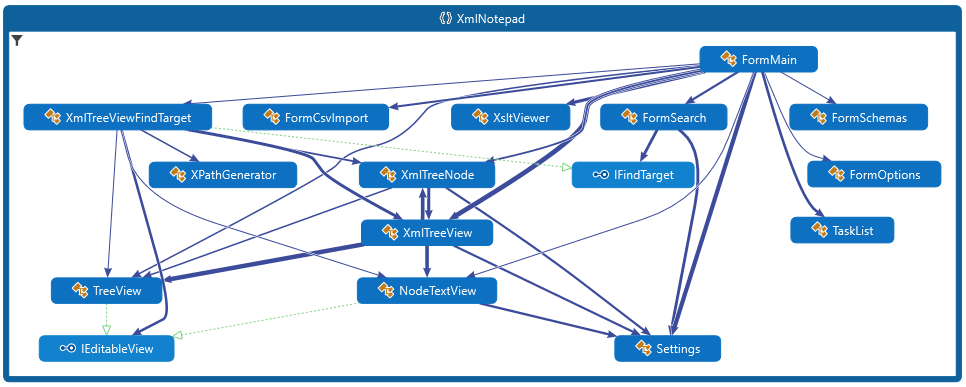
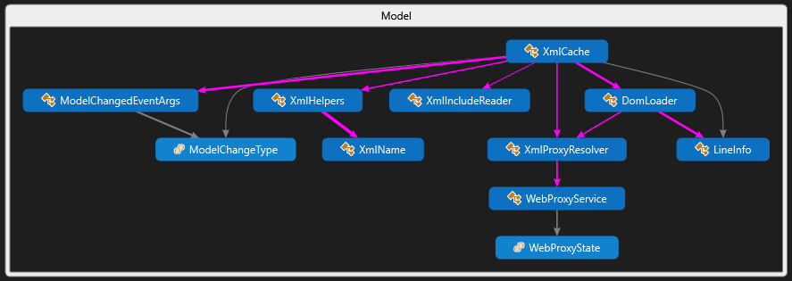
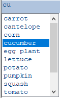
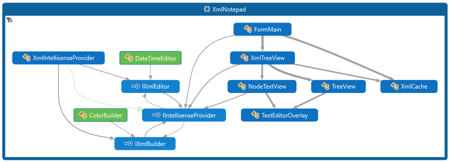
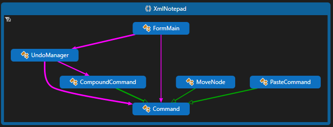
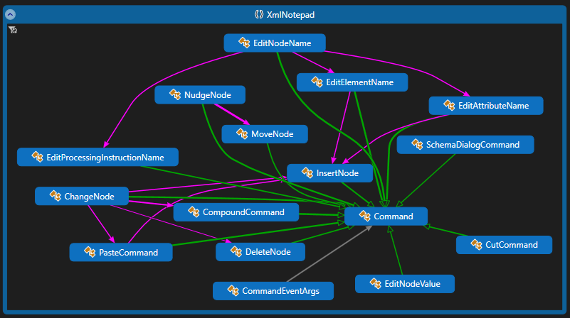

# XML Notepad Design

By [Chris Lovett](http://lovettsoftware.com/), Microsoft

In the GitHub repo, you'll find the core `XmlNotepad` DLL project, an `Application` project that
builds XmlNotepad.exe, and some setup projects like `XmlNotepadSetup` which builds the .msi
installer, and the `UnitTests` project for testing XML Notepad.

The following DGML diagram shows the relationships between the main UI classes. The main form
contains all the UI elements from the TaskList to the main XmlTreeView with Resizers in between;
it's the launching point for the dialogs such as FormSearch, FormSchemas, FormOption, and FormAbout.

The main tab control contains the XmlTreeView and the XsltViewer for showing XSL output. The
XmlTreeView contains a TreeView on the left and a NodeTextView on the right and coordinates
scrolling between these two views. Both the TreeView and NodeTextView provide the same IntelliSense
editing functionality using a TextEditorOverlay component. The XmlTreeView implements IFindTarget,
which is used by the Find dialog (FormSearch) to implement find/replace functionality.

The Find dialog supports full text, regex, or XPath expressions and can filter by names or values.

## Model

The core data model behind the UI is `System.Xml.XmlDocument` and its `XmlNode` objects. These
nodes are wrapped by `TreeNode` UI objects. To facilitate support for the XML Include spec, there is a
custom reader that processes XML Includes, and there is also a custom DomLoader that keeps track of
line information for error messages.

## Validation, IntelliSense, and Custom Editors

The biggest new feature is IntelliSense, which is driven by XML Schema information provided via the
SchemaCache. For example, if your element or attribute is defined by an XSD simpleType and this
simpleType contains a list of enumeration facets, then you will get a drop-down like this:

The way this works is that the Checker runs after each edit operation to validate the document and
report errors in the TaskList. This process also puts `System.Xml.Schema.XmlSchemaType` information
on each element and attribute in the XmlDocument; then, when editing the value of that node, the
TextEditorOverlay uses the `XmlIntelliSenseProvider` to get back a list of possible values. In the
above example, it returns the values from the simpleType enumeration facets. For element name
IntelliSense in the tree view, the `XmlIntelliSenseProvider` invokes the Checker again, captures
GetExpectedParticles and GetExpectedAttributes on the `System.Xml.Schema.XmlSchemaValidator`, and
uses that to provide IntelliSense.

The `TextEditorOverlay` also supports custom editors like the `DateTimeEditor` or the `UriBuilder`
or `ColorBuilder`. There are two types of custom editors: IXmlEditors, which are inline editors that
replace the default TextBox, and IXmlBuilders, which are popup dialogs like the OpenFileDialog or
ColorDialog. The type of editor is derived from the schema type information — "xs:date", "xs:time",
"xs:datetime" results in the DateTimeEditor, and "xs:anyURI" results in the UriBuilder. You can also
annotate the schema with a custom "vs:builder" attribute in the
`http://schemas.microsoft.com/Visual-Studio-IntelliSense` namespace. See the Help content for more
information.

## Infinite Undo/Redo

To implement undo/redo, XML Notepad follows a common design pattern of Command objects with Undo and
Redo methods. Commands operate on both a `TreeNode` and an `XmlNode` because some commands like
`InsertNode` don't have an `XmlNode` yet until they are performed, but the command needs to know
where in the tree this new node will be inserted and during `Undo` where it should be removed. The
UndoManager collects these in a list. Then the state of the UndoManager controls the
enabled/disabled state of the Undo/Redo MenuItems. When the user selects the Undo menu item, the
Undo method is called on the active command, and that command is pushed onto the Redo stack.

Some operations in the editor cause many edits in the tree, including the replace-all operation and
editing the value of a namespace attribute. (When you change the value of a namespace attribute,
every XmlNode bound to that namespace needs to be reconstructed with a new namespace URI, which can
obviously affect a lot of nodes in the tree!) So, to make these operations one atomic undo
operation, there is a `CompoundCommand` object that contains a list of smaller edit commands, and
this CompoundCommand is put into the `UndoManager`.

Other simpler command objects include the following, which all operate on XmlTreeNode and XmlNode
objects:

The PasteCommand is special because it takes random XML text off the clipboard and parses it in
the context of the currently selected element in the tree, inheriting the namespaces in scope. The
helper class TreeData uses the special XmlTextReader constructor that takes an XmlParserContext as
input.

### Accessibility

In order to make testing possible using `System.Windows.Automation`, there are some custom
`AccessibleObject` implementations inside the TreeView and NodeTextView. See `AccessibleNode` and
`AccessibleNodeTextViewNode`. These accessibility classes should also make Windows accessibility
features work better with those custom views.

### Missing Documentation?

If you want more detailed documentation on some aspect of XML Notepad, please create a new [GitHub issue](https://github.com/microsoft/XmlNotepad/issues).
