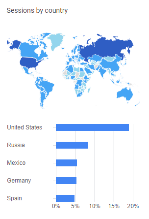

## Analytics

In order to understand which features are important XML Notepad records anonymous usage like:

1. how many times the app is used
2. how many times each feature is used (options, xslt, search, etc)

The data is collected using Google Analytics and shared only with members of the XML Notepad
development team. The data is used to prioritize future work to improve the features that are most
popular.

As a teaser, here is a map of countries where XML Notepad was used in July 2022.  That's super cool
to see a healthy community of users and this motivates the team to keep XML notepad in tip-top
shape.



Here's some raw data from August 2022 to August 2021:

Action        | Counts      | Description
------        | ------      | ------
/App/Launch   | 1,082,553   | Times app was launched
/App/XsltView | 140,703     | Times XSLT view was used
/App/FormSearch | 83,020    | Times the Search dialog was used
/App/FormOptions | 4,448    | Times the Options dialog was used
/XmlNotepad/  | 208,520     | Visits to the web home page
/XmlNotepad/install/ | 78,812  | Visits to the install page

The first time you install XML Notepad on your computer you will be prompted with the following dialog:


Thanks to those who have allowed analytics to be collected, it really helps
to understand usage patterns and prioritize what to improve.
But, if you really need to click `No` then the choice will be written to the XML
Notepad settings file and it will not be prompted again. Analytics can be enabled or disabled any
time using the `Allow analytics` option in the [Options dialog](options.md).

If you want to disable analytics before installing XML Notepad (perhaps in an enterprise wide
distribution) then you can set this environment system wide on the end user's machine:

```
set XML_NOTEPAD_DISABLE_ANALYTICS=1
```

You can also disable the Analytics UI option from appearing in the [Options dialog](options.md)
by setting the `AnalyticsClientId` to disabled in the default [XmlNotepad.settings](settings.md) file as follows:
```xml
<Settings>
  <AnalyticsClientId>disabled</AnalyticsClientId>
  <AllowAnalytics>False</AllowAnalytics>
</Settings>
```

This ensures the user cannot enable analytics after starting XML notepad.
