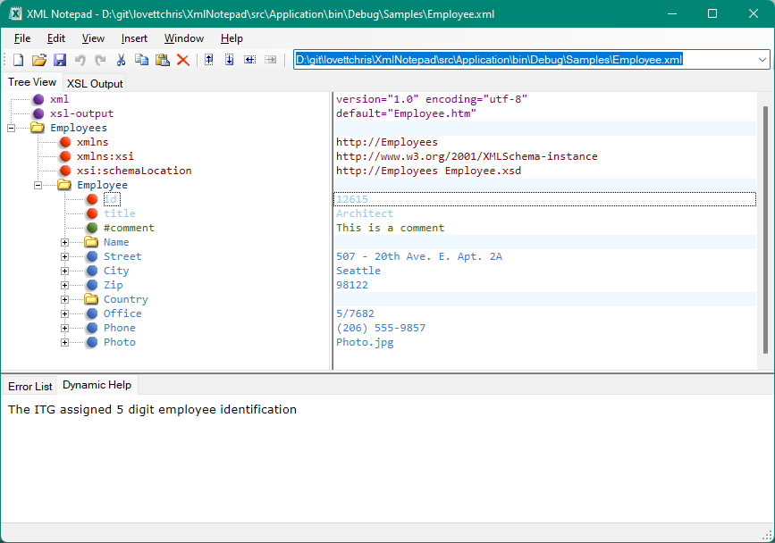

## Dynamic Help

When you have an associated [XSD schema](schemas.md), the `xsd:documentation` associated with the current node is
displayed in a tooltip popup and in the Dynamic Help Tab.

For example, the `Employee.xsd` schema contains the following annotation on the defintion of the Employee Id attribute:

```xml
  <xs:simpleType name="EmployeeID">
    <xs:annotation>
      <xs:documentation xml:lang="en">The ITG assigned 5 digit employee identification</xs:documentation>
      <xs:documentation xml:lang="fr">Le groupe ITG assignés 5 identification d'employé à chiffres</xs:documentation>
    </xs:annotation>
    <xs:restriction base="xs:string">
      <xs:length value="5" />
    </xs:restriction>
  </xs:simpleType>
```

Now if you open Employee.xml and select the Employee Id attribute you will see this annotation listed in the Dynamic
Help tab as follows:



