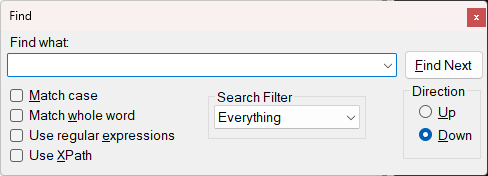

## Find/Replace

Selecting the "Find..." item under the [Edit Menu](menus.md) (CTRL+F) opens the following dialog:

Choosing "Replace..." item under the [Edit Menu](menus.md) (CTRL+H) modifies this dialog to display additional replace
fields:

By default this dialog will allow you to search "Everything" in the current XML document with a specified find string.
You can refine the search using the following options:

**Match case**: Only find nodes that contain the exact search string in the same case.

**Match whole word**: Only find nodes that contain the search string as a complete word, i.e., not a
substring.

**Use Regular Expressions**: Treats the find string as a regular expression. See .NET regular expressions for
help with the regular expression language.

**Use XPath**: Allows you to find nodes using an XPath expression. Choosing this option reveals an extra table
where you can edit the namespace prefix mappings used in the XPath expression. See [XPath
Syntax](https://docs.microsoft.com/en-us/previous-versions/dotnet/netframework-4.0/ms256471(v=vs.100)?redirectedfrom=MSDN)
for help with the XPath expression language.

**Search Filter**: Limits the search to just "Names" which means only search node names, or
"Text" which means only search node values, or "Comments" which means only search comment nodes.

**Direction**: Determines the search direction: "Up" (backwards from the current location) or "Down" (forwards).

**Find Next**: Finds the next matching node in the specified direction after the currently selected node and
highlights the matching substring within the node name or value.

**Replace**: Finds the next matching node in the specified direction after the currently selected node and
replaces it with the specified replace text.

**Replace All**: Replaces all matching text with the specified replace text.