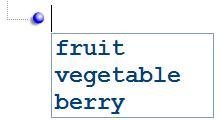

## Intellisense

If an XML schema is provided for validation, the same schema is used to provide intellisense. For instance, if your schema defines an `<xsd:choice>` between the elements "fruit", "vegetable", and "berry", then when you insert a new node at this location, you will be prompted with those choices as shown below:

Similarly, if your schema defines a simpleType with a list of `<xsd:enumeration>` facets, then this list of valid values is prompted when you edit the node value, as shown below:

As you type, the item matching the letters you have typed so far will be automatically selected in the drop-down list. When you press ENTER, the selected item is copied to your edit field, and the intellisense selection is completed, saving you from having to type the whole string manually. This can result in much more efficient editing of XML documents.

XML Notepad also supports special [custom](customeditors.md) editors for well-known data types like date, time, and color.

See also [Schemas Dialog](schemas.md).
