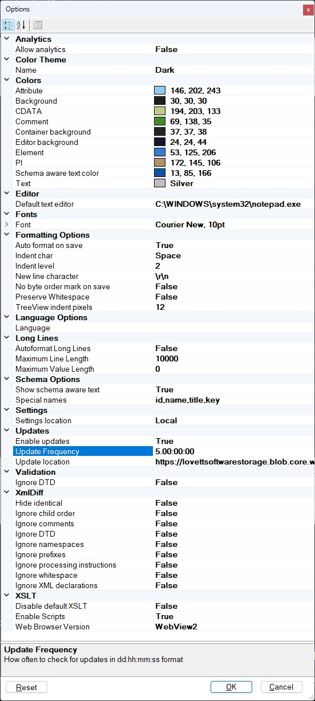

## Options

The options dialog is available from the "Options..." item under the [View Menu](menus.md).
See [Settings](settings.md) for information
on where these settings are stored.

### Analytics
Options that enable or disable the collection of anonymous app usage information.  See [Analytics](analytics.md).

### Color Theme, Colors and Fonts
The options dialog allows you to select a color theme, light or dark, or configure the specific colors used in each type of node as well as the font used and the background color. A drop down arrow on each color lets you pick from different color palettes. You can also customize the font that is used in the XML Notepad tree view.

### Editor
The editor to use if the XML file is invalid and cannot be opened by XML Notepad.

### Formatting
You can also configure the formatting options that are used when you save an XML file, or turn off formatting altogether.  Preserve Whitepsace also controls how the file is opened, when true you will
see all the whitespace nodes in the document, which are used also when the file is saved.
You can also configure the TreeView indentation level in pixels.

### Language
Specify which language annotations to pick from associated XSD schemas.

### Long Lines
How to deal with editing of long lines.

### Schema Options
Controls whether the tree view shows special information with the nodes in the tree.
It will promote the text of the specially named child nodes to the text of the parent
node in the tree.

### Settings Location
Where to store these settings.
See [Settings](settings.md) for more information.

### Updates

These settings configure the auto-update mechanism associated with
the ClickOnce installer. If the "Enable updates" field is true, then XML Notepad will ping the specified "Update Location" for an "Updates.xml" file to see if a new version of XML Notepad is available. See [Updates](updates.md) for more information on how this works.

### Validation
You can turn off DTD validation.

### XmlDiff
Options that control how the XmlDiff works when you compare XML
documents.

### XSLT
Options that control how the the XSLT Output works.
Set `Enable Scripts` to false if you don't trust the script code in your XSLT stylesheets.
Set the `Disable default XSLT` to true if you do not want a default XSLT transform
on documents that have no `<?xml-stylesheet` processing instruction.
Toggle the Web Browser Version to WebView2 if you have the new
[WebView2](https://developer.microsoft.com/en-us/microsoft-edge/webview2/)
component installed on your machine.
Note: the Preserve Whitespace option can also affect XSLT output.
