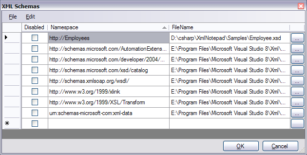

## Schemas

The "Schemas..." item under the [View Menu](menus.md) brings up the following dialog showing the current set of known
XML schemas. These schemas are used for [Validation](validation.md) and [Intellisense](intellisense.md).

You can click the browse buttons on the right-hand side to bring up the Open File Dialog to browse for new files, or you
can select the "Add Files" item in the File Menu to add a batch of schemas. You can click the column
headings to sort by that column.

The first column contains checkboxes, which can be used to temporarily disable a schema from being used in validation.

This list of schemas is persisted in the `XmlNotepad.settings` file, so it is remembered the next time you load XML Notepad.

When you add schemas this way you can create a new document and when you add a new root element you should see some
intellisense showing possible root elements and when you select from the dropdown the new element is associated with the
correct namespace so that intellisense continues from there.

You can also select a row in this dialog and choose `File/Generate XML Instance` to get a new document that contains
a template containing all required elements from the associated schema.  If there is more than one top level element
in the schema a menu will appear from which you can select the element you would like to start with.
See [demo video](ttps://youtu.be/5I_q1oXz02I).