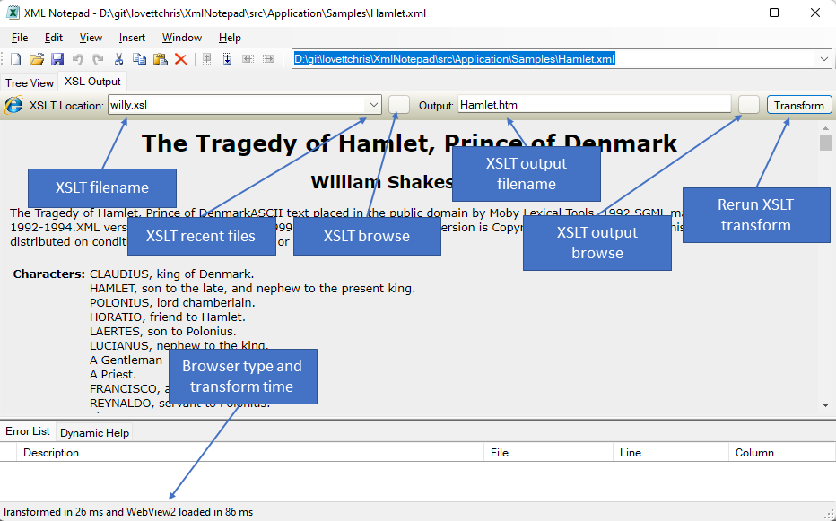

## XSLT Transformation

The `XSL Output` tab on the main window provides a rendering of the
XSLT output from the specified XSLT stylesheet.  XSLT stylesheets can
be referenced in the XML document using this syntax, as shown in the
`hamlet.xml` sample.

```xml
<?xml-stylesheet type="text/xsl" href="willy.xsl"?>
```



You can also enter your own XSLT file name on this tab by changing the
contents of the XSLT Location field at the top of the XSLT output tab.

By default the HTML output is written to the same folder that contains
your XML file, but if that folder is not writable it writes to your system `%TEMP%` folder.

You can also customize the default output file name by adding the
following additional processing instruction to your XML document:

```xml
<?xsl-output default="hamlet"?>
```

Then depending on the `<?xsl-output method="..."` the appropriate file
extension will be added.  You can also override this by directly
editing the Output: text box.  If you modify the XML or XSLT file you
can press the `Transform` button to perform another XSLT
transformation and the changes will be rendered and saved.

This tab supports 2 different web browser engines.  The original
WinForms web browser and the new Chromium based WebView2.  The new
WebView2 control is much faster on large XSLT outputs.

XML Notepad does not automatically install this new WebView2
component.  Please see [Microsoft Edge
WebView2](https://docs.microsoft.com/en-us/DeployOffice/webview2-install)
for information on how to install this optional component.

You will know it is using WebView2 if you see that name mentioned
in the status bar.

If there is no stylesheet associated with your XML document you will
see a default stylesheet that produces an HTML document containing
a colorized version of your XML document.  This default transform
can be disabled in the Options dialog.
