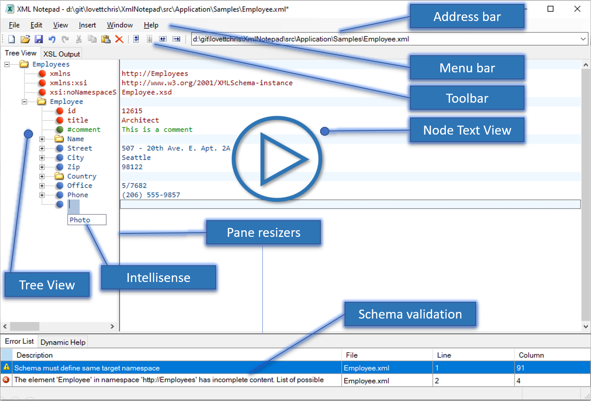

# XML Notepad

XML Notepad provides a simple intuitive [User Interface](help/overview.md) for browsing and editing XML documents.

XML Notepad is the result of a promise Chris Lovett made to a friend at Microsoft. The original XML
Notepad shipped in back in 1998, written by Murray Low in C++. Later on it fell behind in support
for XML standards and, because we didn't have time to fix it, we pulled the downloader. But Murray
apparently did such a nice job that MSDN was inundated with requests to put the notepad back up, so
they asked for a replacement.

Chris was working on System.Xml in C# in 1999, so he figured he could crank out a replacement using
the .NET Framework pretty quickly. Well, the problem was it was one of those side projects on his
"one-day" list — you know how that goes! Fortunately, another good friend, Michael Corning, took
interest in it, helped hold his feet to the fire, and also added some cool features himself. Dan
Doris also took pity on Chris and helped identify some great bugs. So here we are, a nifty tool that
should be useful to those who want a quick way to view and edit XML documents.

There have been over 3 million downloads since then - so thanks to everyone who tried it out!  

### Handy features include:

- Ability to load .csv and .htm files converting them to XML.
- Tree View synchronized with Node Text View for quick editing of node names and values.
- Incremental search (Ctrl+I) in both tree and text views, so as you type it navigates to matching nodes.
- [Cut/copy/paste](help/clipboard.md) with full namespace support.
- [Drag/drop support](help/dragdrop.md) for easy manipulation of the tree, even across different instances of XML Notepad and from the file system.
- Infinite undo/redo for all edit operations.
- In place popup multi-line editing of large text node values.
- Configurable fonts and colors via the [options dialog](help/options.md).
- Full [find/replace dialog](help/find.md) with support for regex and XPath.
- Good performance on large XML documents, loading a 3mb document in about one second.
- Instant [XML schema validation](help/validation.md) while you edit with errors and warnings shown in the task list window.
- [Intellisense](help/intellisense.md) based on expected elements and attributes and enumerated simple type values.
- Support for [custom editors](help/customeditors.md) for date, dateTime and time datatypes and other types like color.
- Handy nudge tool bar buttons for quick movement of nodes up and down the tree.
- Inplace HTML viewer for processing `<?xml-stylesheets` instructions.
- Built-in XML Diff tool.
- Support for XInclude.
- Handy "XML statistics" tool to summarize info about your XML documents.
- Dynamic help from XSD annotations.
- Goto definition to navigate includes and XSD schema information.
- Vibrant community with many [updates and bug fixes](help/updates.md).

The source code is available at [https://github.com/microsoft/XmlNotepad](https://github.com/microsoft/XmlNotepad).

Please provide feedback or any issues you have using the [XML Notepad GitHub
issues](https://github.com/microsoft/XmlNotepad/issues) list.

See [development](dev.md) information on how to build XML Notepad from source.

For more information see the [Code of Conduct
FAQ](https://opensource.microsoft.com/codeofconduct/faq/) or contact
[opencode@microsoft.com](mailto:opencode@microsoft.com) with any additional questions or comments.
