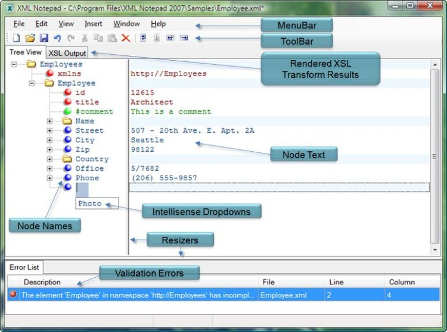

XML Notepad provides a simple intuitive User Interface for browsing and editing XML documents. There are four ways to install it:
1. [ClickOnce® installer](https://lovettsoftwarestorage.blob.core.windows.net/downloads/XmlNotepad/XmlNotepad.application) - this is the most convenient, install it directly from the web browser.
2. [Standalone downloadable installer](https://lovettsoftwarestorage.blob.core.windows.net/downloads/XmlNotepad/XmlNotepadSetup.zip) if you need something that works offline.
Just download the zip file, copy it to the machine you want to install it on, unzip the file on that machine and run `XmlNotepadSetup.msi`.
3. [Windows MSIX installer](https://lovettsoftwarestorage.blob.core.windows.net/downloads/XmlNotepad.Net/index.html) if you need a trusted Windows installer.
4. You can also use [WinGet](https://winget.run/pkg/Microsoft/XMLNotepad) as follows: `winget install XmlNotepad`

[XML Notepad](http://microsoft.github.io/XmlNotepad) provides the following useful features:
- XML Schema aware Intellisense
- Find dialog that supports XPath
- Support for XInclude
- Supports XSLT transforms with inline viewer of XSLT output
- Automatic conversion of .csv files
- Handy stats about your XML documents
- XML diff to compare 2 similar XML documents
- Vibrant community with many [updates and bug fixes](http://microsoft.github.io/XmlNotepad/help/updates/).

See [XML Notepad Design ](http://microsoft.github.io/XmlNotepad/help/design/) for information about how this application is built.

This project has adopted the [Microsoft Open Source Code of Conduct](https://opensource.microsoft.com/codeofconduct/).

For more information see the [Code of Conduct FAQ](https://opensource.microsoft.com/codeofconduct/faq/) or contact [opencode@microsoft.com](mailto:opencode@microsoft.com) with any additional questions or comments.

## Change History

See [Change History](http://microsoft.github.io/XmlNotepad/help/updates/) for list of new features and bug fixes.

## Help

See [Help Pages](http://microsoft.github.io/XmlNotepad).
